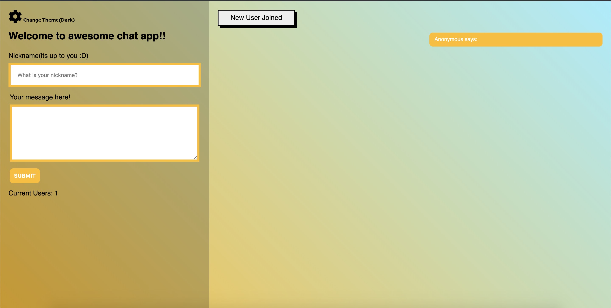
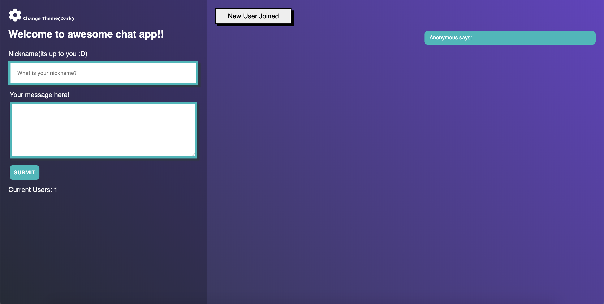

# Chat Application using Node / Vue / socket.io

Used Node and Express to generate the server app; used Vue as template / view
engine client.

## Notes

`node app` to enjoy the chat and improve it.
 visit it live, for fun: https://changseokchatapp.herokuapp.com/

###'Bright Mode'

###'Bright Mode'

## Tools used during development phase:

- socket.io
- Vue.js
- SASS
- Node.js / Express.js
- https://expressjs.com/
